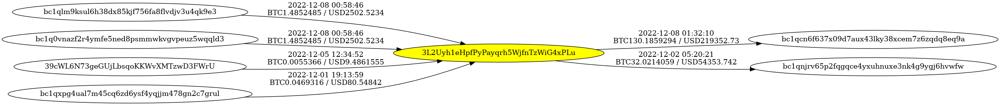

# Bitcoingraph

## Description
Simple python code that performs lookups of Bitcoin transactions for a given address and generates Graphviz DOT graph data files to help visualize Bitcoin transactions for humans. It was inspired by Kevin Perlow's code released at the 2017 SANS DFIR summit and available at [https://github.com/kevinperlow/SANS-DFIR-2017](https://github.com/kevinperlow/SANS-DFIR-2017)

This code makes requests to the Blockchair API, which requires a key for access. You can get a key for cheap at [https://blockchair.com/api/](https://blockchair.com/api/)

## Usage
```yaml
usage: bitcoingraph.py [-h] [-t] [-d] [-btc] [-usd] [-f FILE] [-l] [-o] [--truncate] [--highlight]
                       [address] [address] ...

positional arguments:
  address               One or more target address(es) to graph.

options:
  -h, --help            show this help message and exit
  -t, --time            Add full transaction timestamps to each arrow on the graph.
  -d, --date            Add date-only transaction timestamps to each arrow on the graph.
  -btc, --valuebtc      Add transaction value in BTC to each arrow on the graph.
  -usd, --valueusd      Add transaction value in USD to each arrow on the graph.
  -f FILE, --file FILE  File to read addresses from. One address per line.
  -l, --local           Attempt to find information in local cache before making API calls.
  -o, --offline         Only work from information saved in local cache. No API calls will
                        be made.
  --truncate            Truncate Graphviz data to only include transactions with the target
                        address(es).
  --highlight           Highlight target address(es) on graph.
```

## Example Graph
The example graph below is a truncated graph showing all Bitcoin addresses that made transactions with address 3L2Uyh1eHpfPyPayqrh5WjfnTzWiG4xPLu with the timestamp, value, and highlight options enabled. A full (non-truncated) graph generated for this address is significantly larger.


